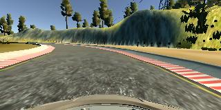
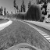
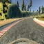
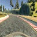
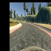

# Project 3: Behavioral Cloning
#### David del Río Medina

###1. The dataset

The data provided by Udacity was used for this project. To make the most of it, all the images from the three cameras (left, front, right) were used to train an validate the final model. For the images from the left and right cameras, the corrected steering angles must be added to the dataset. Following some other students suggestions (e.g. [An augmentation based deep neural network approach to learn human driving behavior](https://chatbotslife.com/using-augmentation-to-mimic-human-driving-496b569760a9)), 0.25 is added (left camera) or substracted (right camera) to the steering angle defined for the input received by the front camera. Other students have tried different offset values (like 0.27 or 0.3) with success.
After this, the images are resized to 64x64, since it makes training faster and consume less memory.
The data is then splitted 80/20 in training and validation datasets. Although this can help spot problems with the model, like overfitting, the only valid test is watching the model drive the car through track 1.
The training dataset is not balanced: some steering angles, like 0.0, are overrepresented, which may cause the model to be biased toward driving the car straight. Another problem is that all the data comes from the same track. Even if a good perfomance in a different setting is not required to pass the project, it will be desirable that the model can generalize to other tracks.
In order to improve generalization,  the training dataset is balanced and augmented by applying filters to create new artificial images from the original data.
Six image transformation processes were used:

- Mirror: the image is flipped horizontally and its corresponding steering angle reversed. This is an easy choice, since it is a quick and robust way of having twice the original data.
- Noise: a random value between [0, 20] is added to every color channel of every pixel. This may help the model be less biased towards specific colors, that can change based on the weather, location, time of the day, and such.
- Brightness: the brightness of the original image is changed randomly. The original data is taken at the same hour, with the same weather. This transformation can help the model generalize better under different lightning conditions.
- Blur: Gaussian blur with a 3x3 kernel is applied to the image. The idea is to make the detection of borders and shapes more flexible.
- Gray: image is converted to grayscale and then back to RGB, to keep the (64, 64, 3) shape. Like the noise transformation, this may help the model be less biased towards specific colors.
- Shift: the original image is shifted horizontally and vertically a random pixel offset between [-16, 16]. The original steering angle is adjusted adding the horizontal offset times 0.005.
This "angle offset per pixel" constant was devised partly by trial and error, partly by estimating the distance in pixels from an image created by the center camera and the corresponding image created by the left camera, following a reference point. This gives an approximate distance of 210 pixels. With the angle correction of 0.25 (also an approximation), we have a correction of 0.25 / 210 = 0.001190476 per pixel for the original sized images, that are 5 times bigger than the resized ones. The estimation suggest a correction of 0.001190476 * 5 = 0.005952381 per pixel for the resized images, but I found out through testing that a constant of 0.005 works better.
This transformation help generating more data, adding angles that are not present in the original data, and simulating slopes.

###### Some examples:

_Original image_

_From left to right: resized to 64x64, blur, brightness, gray, mirror, noise, shift._

The final training dataset is generated following the next procedure:

1. The original data is loaded, including the left and right camera images with their corresponding corrected steering angles.
2. All the images are resized to 64x64.
3. The data is splitted in training and validation datasets.
4. The training data is augmented by adding three versions of each original image by applying blur, gray and mirror transforms.
5. The training data is balanced by adding transformed versions (noise, brightness and shift) to random images with underrepresented steering angles. Since steering angles are continuous, they are grouped into bins of 0.1 width.
